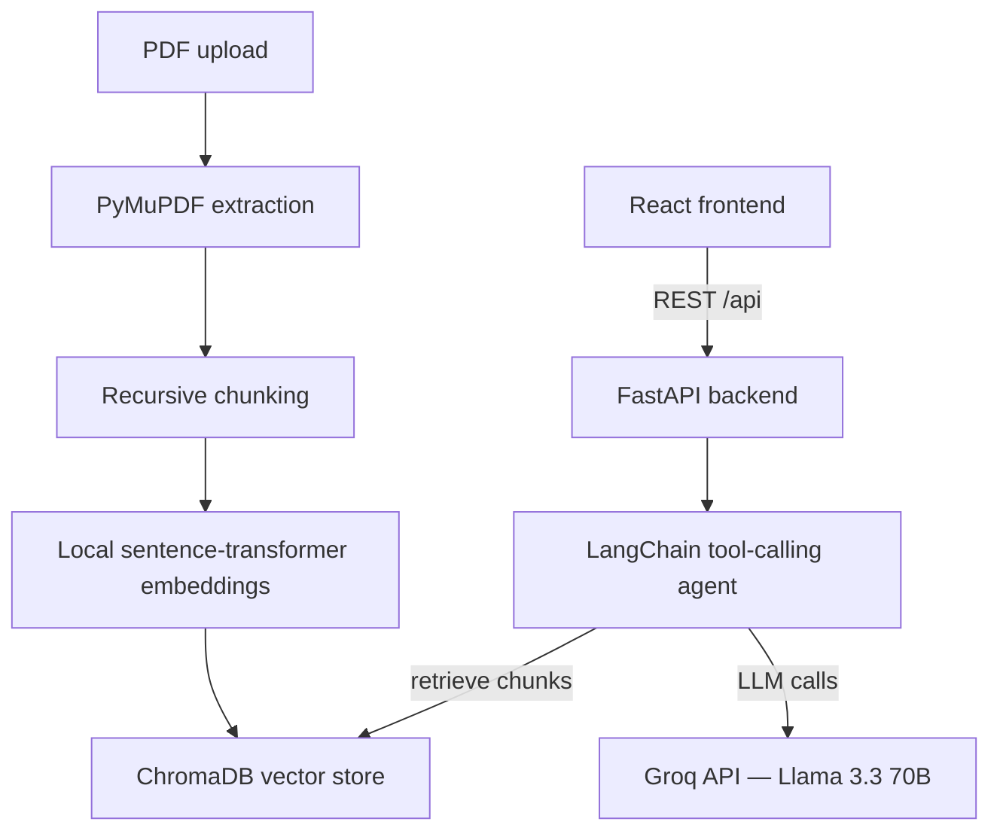

# 📊 Financial Report Analyst

An AI agent that reads quarterly earnings reports and 10-Q/10-K filings, then answers natural-language questions about revenue, profitability, trends, and key metrics — grounded in the actual document, with page-level citations instead of hallucinated numbers.

Built with **LangChain**, **Groq (Llama 3.3)**, **ChromaDB**, **FastAPI**, and **React**.

---

## Why this exists

Reading a 40-page earnings report to find "what was revenue this quarter" is slow and repetitive. This agent retrieves the exact figure from the document and cites the page it came from, instead of relying on the model's memory (which can be wrong or out of date).

## Features

- 📄 **PDF ingestion** — upload any financial report; text is extracted, chunked, and embedded automatically
- 🔍 **Retrieval-augmented answers** — every response is grounded in the actual document via semantic search, not the LLM's training data
- 🧰 **Tool-calling agent** — four purpose-built tools: semantic search, metric extraction, trend detection (QoQ/YoY), and structured summarization
- 💬 **Conversation memory** — follow-up questions like "how does that compare to last quarter?" retain context
- 🔗 **Page citations** — every answer references the page number it was pulled from
- ⚡ **Fast, local embeddings** — uses a local sentence-transformer model, so no embedding API cost or latency

## Architecture



**Runtime flow:** the frontend calls the backend over REST. The agent decides which tool to call, retrieves relevant chunks from the vector store when it needs document context, and sends reasoning/generation to Groq.

**Ingestion flow (runs once per upload):** PyMuPDF extracts text page-by-page → text is split into overlapping ~1000-character chunks → each chunk is embedded locally (no external API call) → vectors are stored in ChromaDB for fast similarity search.

## Tech stack

| Layer | Technology |
|---|---|
| LLM | Groq API — Llama 3.3 70B (tool-calling) |
| Agent framework | LangChain (`create_tool_calling_agent`) |
| PDF extraction | PyMuPDF |
| Vector store | ChromaDB |
| Embeddings | Sentence-Transformers (`all-MiniLM-L6-v2`, local) |
| Backend | FastAPI, Uvicorn |
| Frontend | React (Vite), Axios, React Markdown |
| Rate limiting | SlowAPI |
| Containerization | Docker, Docker Compose |

## Project structure

```
financial-report-analyst/
├── backend/
│   ├── main.py                 # FastAPI app: upload, ask, reset, status, health
│   ├── requirements.txt
│   ├── Dockerfile
│   ├── src/
│   │   ├── config.py            # env/config loader
│   │   ├── pdf_loader.py        # PyMuPDF extraction → LangChain Documents
│   │   ├── chunking.py          # recursive text splitting
│   │   ├── embeddings.py        # local sentence-transformer embeddings
│   │   ├── vectorstore.py       # ChromaDB build/load
│   │   ├── retriever.py         # similarity search + context formatting
│   │   ├── llm.py               # Groq (ChatGroq) client
│   │   ├── prompt.py            # system prompt + agent prompt template
│   │   ├── memory.py            # conversation memory
│   │   ├── tools.py             # 4 custom agent tools
│   │   ├── agent.py             # ties it all into an AgentExecutor
│   │   ├── session_store.py     # per-user session isolation
│   │   └── utils.py
│   └── templates/
│       └── financial_prompt.txt
└── frontend/
    ├── src/
    │   ├── App.jsx
    │   ├── api.js                # backend client
    │   └── components/
    │       ├── FileUpload.jsx
    │       └── ChatWindow.jsx
    ├── Dockerfile
    └── nginx.conf
```

## Getting started

### Prerequisites
- Python 3.11+
- Node.js 18+
- A free [Groq API key](https://console.groq.com/keys)
- Docker Desktop (optional, for containerized setup)

### Option A — Local development

```bash
# Backend
cd backend
python -m venv venv
source venv/bin/activate        # Windows: venv\Scripts\activate
pip install -r requirements.txt
cp .env.example .env            # then add your GROQ_API_KEY
uvicorn main:app --reload --port 8000
```

```bash
# Frontend (separate terminal)
cd frontend
npm install
npm run dev
```

Open **http://localhost:5173**. Backend API docs: **http://localhost:8000/docs**.

### Option B — Docker Compose

```bash
cp backend/.env.production.example backend/.env   # fill in GROQ_API_KEY
cp backend/.env .env                                # Compose reads root .env
docker compose up --build
```

Open **http://localhost:5173**. Health check: **http://localhost:8000/health**.

## API reference

| Method | Endpoint | Description |
|---|---|---|
| `GET` | `/api/status` | Whether a report is loaded for the current session |
| `POST` | `/api/upload` | Upload a PDF (`multipart/form-data`, field `file`) — extracts, chunks, embeds, indexes |
| `POST` | `/api/ask` | `{"question": "..."}` → `{"answer": "..."}` |
| `POST` | `/api/reset` | Clears conversation memory |
| `GET` | `/health` | Liveness probe |

## Environment variables

| Variable | Description | Default |
|---|---|---|
| `GROQ_API_KEY` | Your Groq API key | *(required)* |
| `GROQ_MODEL` | Groq model ID | `llama-3.3-70b-versatile` |
| `ALLOWED_ORIGINS` | Comma-separated frontend origins allowed by CORS | `http://localhost:5173` |
| `CHUNK_SIZE` / `CHUNK_OVERLAP` | Text splitting parameters | `1000` / `150` |
| `MAX_UPLOAD_MB` | Max PDF upload size | `20` |
| `UPLOAD_RATE_LIMIT` / `ASK_RATE_LIMIT` | Per-IP rate limits | `5/minute` / `20/minute` |
| `SESSION_TTL_SECONDS` | Idle session expiry | `3600` |

## Design notes

- **Grounded answers, not hallucinations** — the agent always retrieves document chunks before answering, and cites page numbers, rather than relying on the LLM's own knowledge of the company.
- **Local embeddings** — chose a local sentence-transformer model over an embedding API to keep this free to run and avoid sending report contents to a third party.
- **Per-session isolation** — each user gets their own agent instance (via an httponly session cookie), not a shared global state, so concurrent users don't see each other's reports.
- **Retry on transient tool-call failures** — Groq's streaming tool-calling occasionally returns a malformed function call; the agent retries automatically rather than surfacing a raw error.

## Known limitations / production considerations

- Session state is currently in-memory per backend process — horizontal scaling to multiple workers/replicas needs either sticky sessions at the load balancer or moving memory into Redis.
- The vector store and uploaded files live on local disk (or a Docker volume) — a multi-server deployment would need shared/object storage instead.
- No authentication layer — anyone with the URL can use the app, rate-limited by IP only.
- Scanned/image-only PDFs aren't supported yet (no OCR fallback).

## Roadmap

- [ ] OCR fallback for scanned PDFs
- [ ] Streaming responses (token-by-token) in the chat UI
- [ ] Multi-report comparison (upload two reports, ask comparative questions)
- [ ] Redis-backed sessions for multi-instance deployment
- [ ] MCP server support

## License

MIT — see [LICENSE](LICENSE).

## Disclaimer

This tool is for informational analysis only. It is not a licensed financial advisor and its output should not be treated as investment advice.
